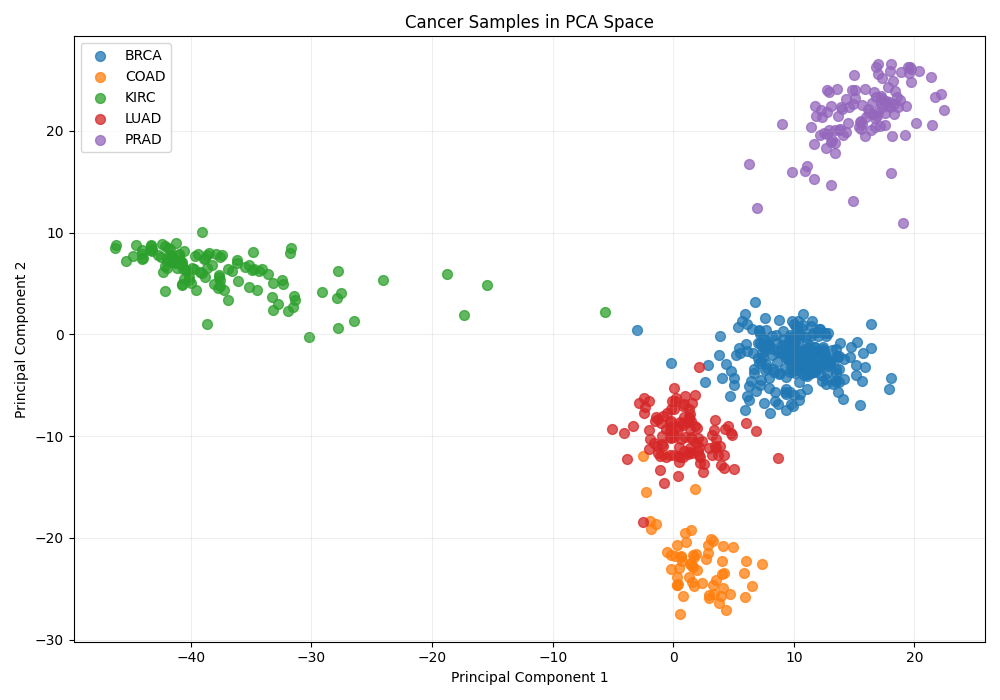

# Cancer Type Classification from RNA-Seq Gene Expression

An end-to-end computational biology project that classifies five cancer types from high-dimensional RNA sequencing data. The repository combines a modular preprocessing pipeline, a multiclass softmax classifier implemented from scratch, scikit-learn baselines, gene-selection experiments, and biological visualizations.



## Project highlights

- Classified **801 tumor samples** across five cancer types using **20,531 gene-expression features**.
- Achieved **99.4% held-out test accuracy (160/161 samples)** with ANOVA feature selection, PCA, and a custom NumPy softmax classifier.
- Reduced 20,531 starting features to 1,000 ANOVA-selected genes and then 50 principal components, which retained approximately **86.6% of the selected-feature variance**.
- Implemented **multiclass logistic regression** and **Nearest Shrunken Centroids (NSC/PAM)** from their mathematical definitions instead of relying only on library estimators.
- Compared two gene-selection strategies: ANOVA and NSC shared **760 selected features**, with a Jaccard similarity of **0.612**.
- Built PCA plots, expression heatmaps, class-specific histograms, and NSC score visualizations to connect model behavior with the underlying biology.

## Why this is a biology problem

RNA sequencing estimates the abundance of RNA transcripts, producing a gene-expression profile for each tumor. Because tumors from different tissues retain different [cell-of-origin and regulatory programs](https://www.cancer.gov/news-events/press-releases/2018/tcga-pancancer-atlas), their expression profiles can contain enough structure to distinguish cancer types. RNA-Seq data are therefore useful for studying how transcriptional activity differs across tumors, not just which DNA variants they carry.

This project uses the [UCI Gene Expression Cancer RNA-Seq dataset](https://archive.ics.uci.edu/dataset/401/gene%2Bexpression%2Bcancer%2Brna%2Bseq), a random extraction from the TCGA Pan-Cancer Illumina HiSeq dataset. The [Genomic Data Commons](https://docs.gdc.cancer.gov/Encyclopedia/pages/RNA-Seq/) explains how RNA-Seq reads are converted into gene-expression measurements, and the [National Cancer Institute](https://www.cancer.gov/ccg/research/genome-sequencing/tcga) provides background on The Cancer Genome Atlas.

| Code | Cancer type | Samples |
| --- | --- | ---: |
| BRCA | Breast invasive carcinoma | 300 |
| KIRC | Kidney renal clear cell carcinoma | 146 |
| LUAD | Lung adenocarcinoma | 141 |
| PRAD | Prostate adenocarcinoma | 136 |
| COAD | Colon adenocarcinoma | 78 |

The biological question is: **Can a tumor's transcriptomic profile identify its cancer type, and which expression features contribute most strongly to that separation?**

The distributed UCI files use anonymous names such as `gene_9175` rather than gene symbols. These features can be described as discriminative expression markers, but they should not be presented as clinically validated or causal biomarkers until they are mapped back to real gene identifiers and validated in an independent cohort.

## Machine-learning pipeline

```text
RNA-Seq matrix (801 samples × 20,531 genes)
            │
            ▼
Low-variance filtering (20,531 → 19,967 genes)
            │
            ▼
Stratified 80/20 train/test split (640 / 161 samples)
            │
            ▼
ANOVA F-test fitted on training data (top 1,000 genes)
            │
            ▼
Standardization fitted on training data
            │
            ▼
PCA fitted on training data (1,000 → 50 components)
            │
            ▼
Custom softmax regression / linear SVM / NSC
            │
            ▼
Accuracy, precision, recall, F1, and confusion matrix
```

The steps address the central difficulty of this dataset: there are far more features than samples (`p >> n`), so an unconstrained model could memorize the training set.

1. **Variance filtering** removes nearly constant genes that provide little information.
2. **Stratification** preserves the class proportions in both data splits, which matters because COAD has many fewer samples than BRCA.
3. **ANOVA feature selection** ranks each gene by the ratio of between-class variability to within-class variability. Only the training labels are used to select the top 1,000 genes.
4. **Standardization** converts each selected feature to a comparable scale: `z = (x - mean) / standard deviation`.
5. **PCA** finds eigenvector directions of the training covariance matrix and keeps the 50 directions with the largest eigenvalues. These components compress correlated genes into a smaller, non-redundant representation.
6. **Softmax regression** learns one linear score per cancer type. The custom classifier turns those scores into probabilities with `P(y=k|x) = exp(s_k) / sum_j exp(s_j)` and minimizes multiclass cross-entropy using gradient descent.
7. **Linear SVM** learns decision boundaries with the largest possible class margins. It is a strong baseline for high-dimensional datasets.
8. **[Nearest Shrunken Centroids](https://pubmed.ncbi.nlm.nih.gov/12011421/)** compares a sample with class-average expression profiles, then soft-thresholds weak class-specific differences toward zero. This provides an alternate route to sparse, class-specific feature selection.

## Results

| Analysis | Result | Interpretation |
| --- | ---: | --- |
| Custom softmax classifier | **99.4%** held-out accuracy | 160 of 161 test samples classified correctly |
| Linear SVM baseline | **99.4%** held-out accuracy | A regularized library baseline matches the custom model |
| PCA | **86.6%** variance retained | 50 components preserve most variation in the 1,000 selected genes |
| NSC threshold sweep | **99.4%** best observed test accuracy | Exploratory result; the threshold was compared on the test set |
| ANOVA vs. NSC | **760 shared features** | Approximately 76% of each ~1,000-feature set overlaps |

The separation visible in the PCA plot supports the classification result: prostate and kidney tumors form especially distinct clusters, while breast, lung, and colon samples occupy closer regions with limited overlap.

These are research results on one curated dataset, not evidence that the model is ready for diagnosis. The test set estimates performance on this dataset only.

## Repository structure

```text
hackathon_project/
├── main_work.py                 # Primary end-to-end entry point
├── pipeline_steps/              # Reusable loading, preprocessing, models, evaluation
├── experiments/                 # SVM, NSC, PCA, feature-selection, and OOD studies
├── visualizations/              # Reproducible plotting scripts
├── dataset/                     # RNA-Seq matrix and cancer labels
├── results/
│   ├── figures/                 # Generated PCA plots, heatmaps, and histograms
│   └── tables/                  # Gene-selection and NSC experiment outputs
├── requirements.txt
└── README.md
```

The root contains one obvious entry point. Reusable functions live in `pipeline_steps/`; one-off comparisons live in `experiments/`; plotting code lives in `visualizations/`; and generated artifacts live in `results/`.

## Quick start

The large expression matrix is stored with Git LFS. Install Git LFS before pulling the data.

```bash
git clone <repository-url>
cd hackathon_project
git lfs install
git lfs pull

python3 -m venv .venv
source .venv/bin/activate
python3 -m pip install -r requirements.txt
python3 main_work.py
```

The main program prints the class distribution, dimensionality after each preprocessing step, explained PCA variance, classification report, and confusion matrix.

## Reproduce the experiments

Run commands from the repository root so Python can resolve the local packages.

```bash
# Scikit-learn linear SVM baseline
python3 -m experiments.svm_baseline

# PCA component-count sensitivity
python3 -m experiments.pca_component_sweep

# Nearest Shrunken Centroids and gene exports
python3 -m experiments.nearest_shrunken_centroids

# Compare ANOVA-selected and NSC-selected features
python3 -m experiments.compare_gene_selection

# Test whether an SVM can distinguish synthetic profiles from real tumors
python3 -m experiments.synthetic_sample_detection
```

Generate the figures with:

```bash
python3 -m visualizations.gene_expression_heatmaps
python3 -m visualizations.anova_selected_gene_heatmap
python3 -m visualizations.anova_gene_histograms
python3 -m visualizations.nsc_gene_heatmap
```

To explore the pipeline interactively after loading its imports and dataset paths:

```bash
python3 -i -m experiments.repl_setup
```

## Resume-ready framing

Use the parts that match the role you are applying for, and keep the evaluation qualifier (“held-out”) with the accuracy claim.

- Built a modular RNA-Seq cancer classification pipeline for 801 tumors across five TCGA cancer types, reducing 20,531 expression features with ANOVA and PCA and achieving **99.4% held-out accuracy**.
- Implemented multiclass softmax regression and Nearest Shrunken Centroids from scratch in NumPy, then benchmarked them against a scikit-learn linear SVM.
- Compared statistical and centroid-based gene-selection methods, identifying 760 shared expression features and producing publication-style PCA, heatmap, and distribution visualizations.
- Connected high-dimensional machine learning with cancer biology by analyzing tissue-specific transcriptomic patterns while documenting limits around anonymized genes and clinical generalization.

## Limitations and next steps

- Move low-variance filtering inside the training-only preprocessing pipeline so every learned transformation is isolated from the test data.
- Put ANOVA, scaling, and PCA inside each cross-validation fold with a scikit-learn `Pipeline`; use nested cross-validation for hyperparameter selection.
- Select the NSC shrinkage threshold with training-only cross-validation rather than choosing the best test-set result.
- Recover real gene identifiers from the original TCGA feature metadata, then perform pathway enrichment and literature-supported biological interpretation.
- Evaluate on an independent external cohort and investigate batch effects, demographic representation, calibration, and robustness to out-of-distribution samples.

## Contributors

Tristen Turlington, Ben Anderson, Mariah, and Addi Bruening.
